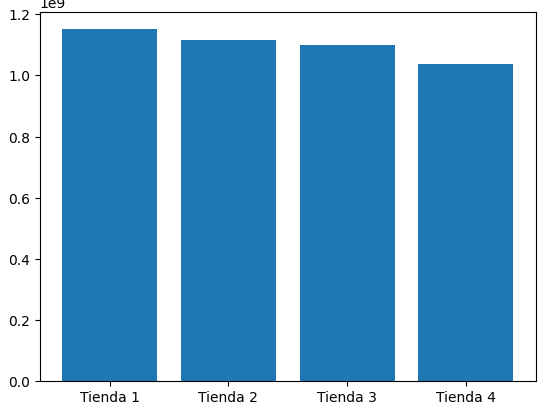
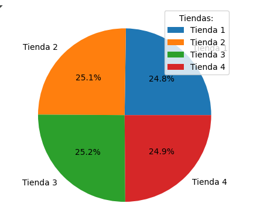
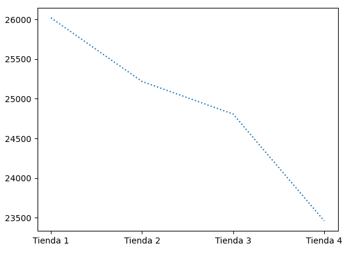

# AluraStore
Durante este desafío, se realizó un análisis exhaustivo para ayudar al Sr. Juan, propietario de Alura Store, a decidir cuál de sus cuatro tiendas debe vender para iniciar un nuevo emprendimiento. El Objetivo del reto identificar, mediante datos reales, la tienda menos eficiente con base en su rendimiento financiero, calificaciones de clientes y costos de envío.

# 📊 Análisis de Eficiencia en Tiendas - Alura Store

Durante este desafío escolar, se realizó un análisis exhaustivo para ayudar al Sr. Juan, propietario de Alura Store, a decidir cuál de sus cuatro tiendas debe vender para iniciar un nuevo emprendimiento.

El objetivo fue identificar, mediante datos reales, la tienda menos eficiente con base en su rendimiento financiero, calificaciones de clientes y costos de envío.

---

## 📌 Descripción del Proyecto

Este proyecto compara el desempeño de **cuatro tiendas** de Alura Store usando indicadores clave:

- **Facturación total**
- **Calificaciones de los clientes**
- **Costo promedio de envío**

> **Plataforma utilizada**: [Google Colab](https://colab.research.google.com/)  
> **Lenguaje**: Python  
> **Bibliotecas**: `pandas`, `matplotlib`, `seaborn`

---

## 🧮 Datos Analizados

| Tienda   | Facturación (MXN) | Calificación Promedio | Costo de Envío (MXN) |
|----------|-------------------|------------------------|----------------------|
| Tienda 1 | 1,150,880,400.00  | 3.97                   | 26,018.61            |
| Tienda 2 | 1,116,343,500.00  | 4.04                   | 25,216.24            |
| Tienda 3 | 1,098,019,600.00  | 4.05                   | 24,805.68            |
| Tienda 4 | 1,038,375,700.00  | 3.99                   | 23,459.46            |

---

## 📈 Visualizaciones

A continuación, algunos gráficos generados durante el análisis:

### 🔹 Facturación por Tienda

### 🔹 Calificación Promedio de Clientes

### 🔹 Costos Promedio de Envío

---

## ✅ Conclusión

Tras analizar los datos, **Tienda 4** fue identificada como la **menos eficiente**, debido a:

- La **menor facturación total** entre las tiendas.
- Una **calificación promedio** inferior a la de las tiendas 2 y 3.
- Aunque tiene el **menor costo de envío**, esto no compensa sus debilidades en desempeño financiero y satisfacción del cliente.

📌 **Recomendación:** Vender la **Tienda 4** para liberar recursos e iniciar el nuevo proyecto del Sr. Juan.

---

## 🛠️ Cómo Ejecutar

1. Abre el archivo `alura_store_analysis.ipynb` en Google Colab.
2. Asegúrate de tener instaladas las bibliotecas `pandas`, `matplotlib`, y `seaborn`.
3. Ejecuta todas las celdas para ver el análisis completo.

---

## 👨‍💻 Autor

**[Juan Carranza]**  
Estudiante de análisis de datos, entusiasta del aprendizaje automatizado y la inteligencia empresarial.
